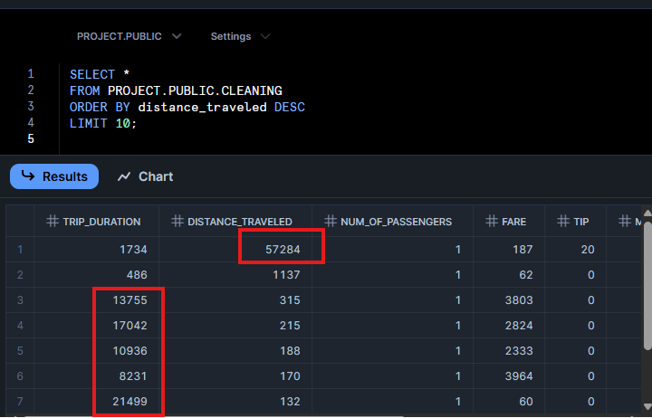
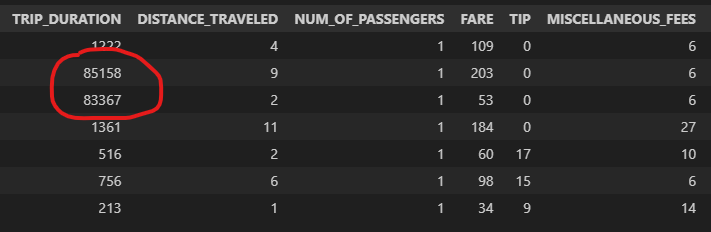
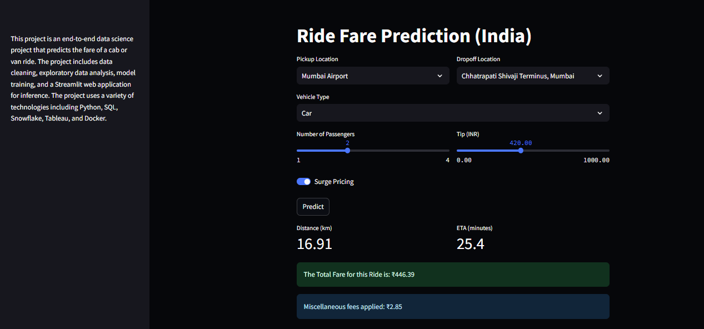

# Ride Price Prediction

## Project Overview

This project is an end-to-end data science project that predicts the fare of a cab or van ride. The project includes data cleaning, exploratory data analysis, model training, and a Streamlit web application for inference. The project uses a variety of technologies including Python, SQL, Snowflake, Tableau, and Docker.


Try here on Streamlit cloud
https://ridefareprediction.streamlit.app/
## Tech Stack

          

## Project Structure

```
├── .dockerignore
├── .env
├── dockerfile
├── README.md
├── requirements.txt
├── .streamlit
│   └── config.toml
├── app
│   └── app.py
├── data
│   ├── clean.csv
│   └── ride.csv
├── images
│   ├── create table.png
│   ├── load csv into table.png
│   ├── outliers.png
│   └── outliers2.png
├── models
│   └── lightgbm.pkl
├── notebooks
│   ├── EDA.ipynb
│   └── selection_Training.ipynb
├── sql
│   ├── cleaning.sql
│   └── createTable.sql
└── Tableau Workbook
    ├── CAB AND VAN PRICING.twb
    └── Van and Cab Pricing Dashboard.png
```

## Setup and Installation

1. **Clone the repository:**
   ```bash
   git clone https://github.com/your-username/Ride_Price_Prediction.git
   ```
2. **Create a virtual environment:**
   ```bash
   python -m venv venv
   source venv/bin/activate
   ```
3. **Install the dependencies:**
   ```bash
   pip install -r requirements.txt
   ```
4. **Set up environment variables:**
   - Create a `.env` file in the root directory.
   - Add your Snowflake credentials to the `.env` file:
     ```
     SNOWFLAKE_USER=<your_user>
     SNOWFLAKE_PASSWORD=<your_password>
     SNOWFLAKE_ACCOUNT=<your_account>
     SNOWFLAKE_WAREHOUSE=<your_warehouse>
     SNOWFLAKE_DATABASE=<your_database>
     SNOWFLAKE_SCHEMA=<your_schema>
     ```
5. **Run the Streamlit application:**
   ```bash
   streamlit run app/app.py
   ```

## Docker

To run the application using Docker, follow these steps:

1. **Build the Docker image:**
   ```bash
   docker build -t ride-price-prediction .
   ```
2. **Run the Docker container:**
   ```bash
   docker run -p 8501:8501 ride-price-prediction
   ```

The application will be available at `http://localhost:8501`.

## Data Pipeline

1. **Data Ingestion & Storage:**
   - A table is created in Snowflake to store the ride data.
   - The CSV dataset is imported into the Snowflake table.
   - 
   - 

2. **Initial Cleaning & Exploration:**
   - Basic cleaning and filtering are performed in SQL to prepare the data for analysis.

## Exploratory Data Analysis (EDA)

- Outliers in the data were identified and handled using box plots and distribution checks in Python.
- 
- 
## Tableau Dashboard

A Tableau dashboard was created to visualize the ride data and the model's predictions.


## Streamlit Application

A Streamlit application has been developed to provide an interactive interface for the ride fare prediction model. Users can input various parameters such as pickup and dropoff locations, vehicle type, number of passengers, and tip amount, and the application will predict the total fare for the ride.


## Model Training and Evaluation

- Several machine learning models were trained to predict the ride fare. The performance of the models is as follows:

| Model              | R2 Score | RMSE      |
|--------------------|----------|-----------|
| LightGBM           | 0.910    | 25.12     |
| XGBoost            | 0.908    | 25.38     |
| Random Forest      | 0.886    | 28.32     |
| Linear Regression  | 0.817    | 35.86     |
| SVR                | 0.760    | 41.03     |

- The LightGBM model performed the best and is used in the final application.
- The trained LightGBM model is saved in the `models` directory.

